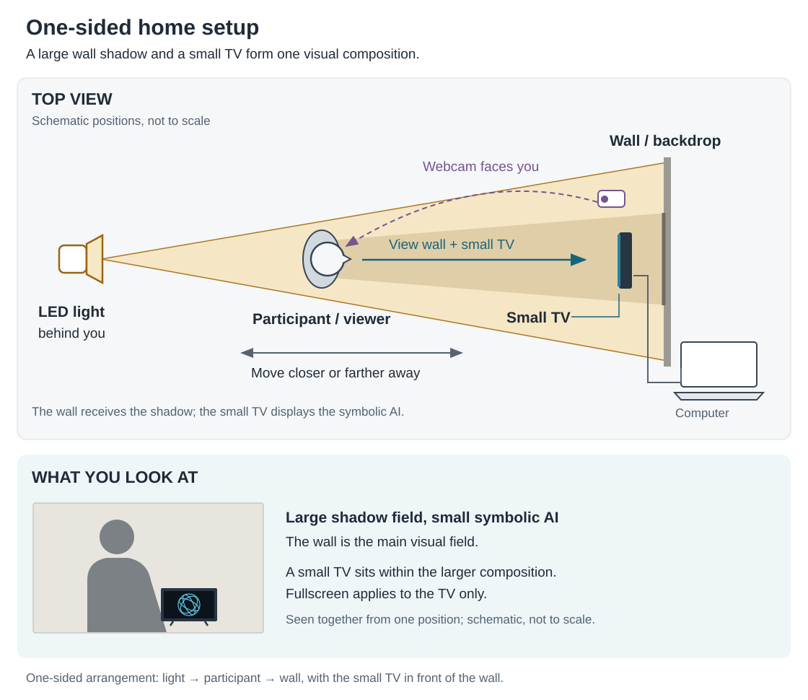

# Hai-hAI

*Hai-hAI* is an interactive artwork that stages a speculative encounter with AI imagined as a “companion species.” Combining simulated affective responses with light and shadow, it invites participants to explore care, empathy and embodied ways of relating with AI.

Facial-expression-based emotion detection provides input to artist-defined response rules and accumulated mood states, which drive an abstract visualization—the artwork’s symbolic AI. This repository shares the software component and a guide to experiencing the work at home.

## Experience it at home

The simplified setup brings a **small TV and a larger wall shadow into one visual composition**. You face the wall, see the symbolic AI on the TV, and watch your shadow change around it. No two-sided screen or separate viewing area is needed.

You will need:

- A computer connected to a small TV or monitor.
- A webcam connected to the computer and positioned near the TV.
- A directional LED light behind you.
- A plain, light-colored wall, a dimmable room and clear space to move.

### Set up and start

1. **Position the display.** Place the TV on a low, stable support near the wall. Leave plenty of wall visible around it so the TV remains a small element in the overall composition.
2. **Arrange the light and camera.** Aim the light past you toward the wall: **light → participant → wall**. Place the webcam near the TV, facing you. Add gentle front or side lighting if your face is too dark.
3. **Open the software.** Open the hosted site over HTTPS in a desktop browser, or follow the [local-running instructions](docs/TECHNICAL.md#run-the-experience). Select **Open camera controller**, then **Start camera**, and allow camera access. Wait for loading and check that the face box follows you.
4. **Show the visualization.** Use an extended desktop to place the visualization on the TV and keep the controller on the computer. Keep both open in the same browser profile on the same computer. Select **Exhibition mode** to fill the TV with the visualization; press **Esc** to restore the controls.
5. **Balance the composition.** Adjust the lamp angle and TV brightness until the wall shadow and symbolic AI are both clear. Keep cables out of the movement area and all equipment securely supported.

### Explore the encounter

Try different facial expressions, then pause to observe the immediate simulated response and slower mood changes. Move toward the light to enlarge your shadow, or toward the wall to reduce it, while keeping your face in the camera’s view. Explore how the larger bodily shadow changes in relation to the smaller symbolic AI.

The wall receives the physical shadow; the software generates the visualization. Emotion detection provides category estimates, not measurements of your felt emotions. Select **Stop camera** when finished.

## About this adaptation

This guide adapts the installation described in *Embodied Relating with AI: Speculative Encounter and Empathy through Hai-hAI* (Fig. 8, Fig. 10, Fig. 11 and Sec. 5.3). See the [paper-to-home diagram](docs/diagrams/paper-to-home.svg) for the relationship between the original installation and this simplified arrangement.

Camera images are processed locally in your browser; the application does not record or upload them.

For hosting, implementation details and troubleshooting, see the [technical reference](docs/TECHNICAL.md). Original code is released under the [MIT license](LICENSE); bundled components retain their [separate licenses](THIRD_PARTY_NOTICES.md).
